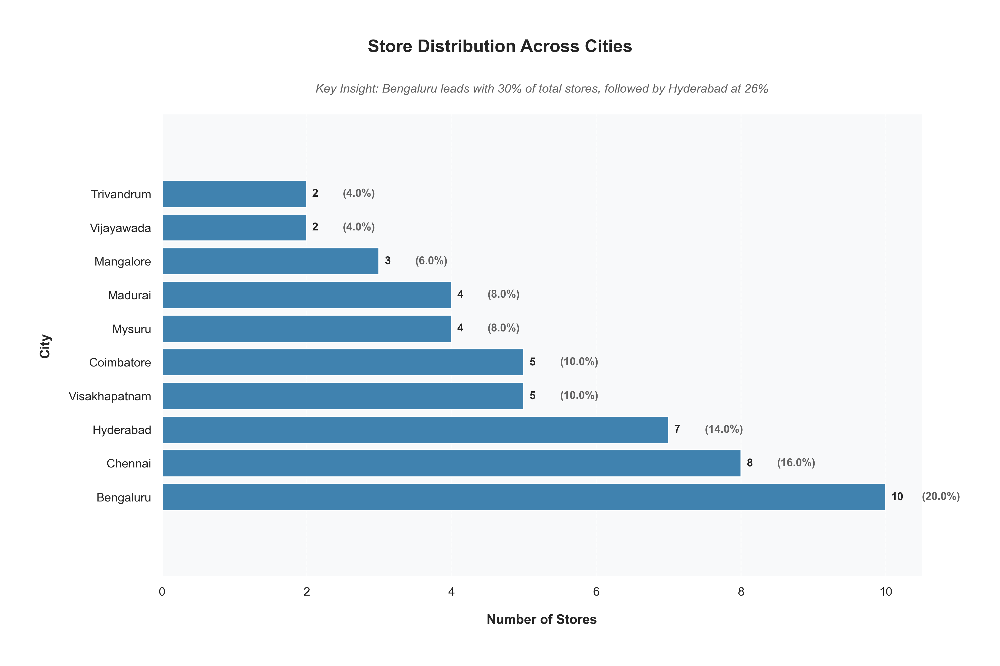

# Nova Mart Campaign Performance Analysis
## Retail Promotion Effectiveness Study

# Project Background
As a data analyst at Nova Mart, I am analyzing the effectiveness of our promotional campaigns across southern India. Nova Mart operates 50 stores and specializes in providing quality products to diverse customer segments, with a focus on Nova-branded products.

The analysis focuses on two major promotional campaigns:
* Diwali Campaign 2023
* Sankranti Campaign 2024

Insights and recommendations are provided on the following key areas:

- **Revenue Impact:** Analysis of revenue changes across categories and locations
- **Store Performance:** Geographic performance variations and store-level metrics
- **Category Analysis:** Product category distribution and growth patterns
- **Price Sensitivity:** Price-volume relationships and promotional effectiveness

The analysis was performed using Python, leveraging pandas for data manipulation, matplotlib and seaborn for visualizations, and numpy for statistical computations. The complete analysis notebook can be found here [link to Jupyter notebook].

# Data Structure & Initial Checks

The analysis utilizes multiple data sources tracking campaign performance across various dimensions:

- **Sales Data:** Pre and post-promotion sales metrics
- **Store Information:** Location and performance data
- **Product Data:** Category hierarchies and pricing information
- **Campaign Metrics:** Promotion types and effectiveness measures

The pre-promotion sales distribution analysis reveals interesting patterns across categories:

*Key Distribution Insights:*
- All categories show right-skewed distributions
- Grocery & Staples shows highest volume and widest spread
- Home Care and Personal Care show similar patterns
- Home Appliances has most concentrated distribution

# Executive Summary

### Overview of Findings

The analysis reveals significant variations in campaign performance across categories and locations. In Bengaluru, the study shows an overall revenue increase of 81.3%, with Combo1 leading at 141.7% growth. Four out of five categories showed positive revenue growth, with only Personal Care facing challenges (-32.4%).

The visualization above demonstrates:
- Strong performance in combo offerings
- Solid growth in core categories
- Opportunities in Personal Care segment

# Insights Deep Dive
### Revenue Performance:

* **Category-wise Analysis - Bengaluru Market**
  - Combo1: 141.7% revenue growth
  - Home Appliances: 88.3% growth
  - Home Care: 51.1% growth
  - Grocery & Staples: 13.0% growth
  - Personal Care: -32.4% decline

### Promotional Effectiveness:

* **City-wise Performance Analysis**
  

Key findings:
- Madurai leads with 121.3% ISU%
- Strong performance in southern metros
- Regional variations indicate need for localized strategies

### Store Network Analysis:

* **Geographic Distribution**

Distribution highlights:
- Bengaluru: 10 stores (20%)
- Chennai: 8 stores (16%)
- Hyderabad: 7 stores (14%)
- Strategic presence in tier-2 cities

### Price Sensitivity Analysis:

* **Price-Volume Relationships**

Key insights:
- Weak price-volume correlation (0.27)
- Strong pre-post price consistency (0.98)
- Low R² value (0.073) indicates price is not primary driver

# Recommendations:

Based on the comprehensive analysis, we recommend:

1. **Category Strategy**
   - Leverage strong Combo1 performance
   - Address Personal Care category challenges
   - Expand successful Home Appliances promotions
   
2. **Regional Approach**
   - Customize promotions for top-performing cities
   - Optimize store network based on performance
   - Develop tier-2 market strategies

3. **Promotional Design**
   - Focus on non-price value propositions
   - Implement category-specific promotions
   - Balance volume and revenue growth

4. **Price Optimization**
   - Maintain consistent base pricing
   - Develop category-specific pricing strategies
   - Consider regional price variations

# Assumptions and Caveats:

Key assumptions in this analysis include:

1. **Data Consistency**
   - Promotional periods are comparable
   - No major external market disruptions
   - Consistent data collection methods

2. **Market Conditions**
   - Similar competitive environment across regions
   - Normal seasonal patterns
   - Standard operational conditions

3. **Statistical Assumptions**
   - Normal distribution of sales data
   - Independent store performance
   - Consistent customer behavior patterns

---
