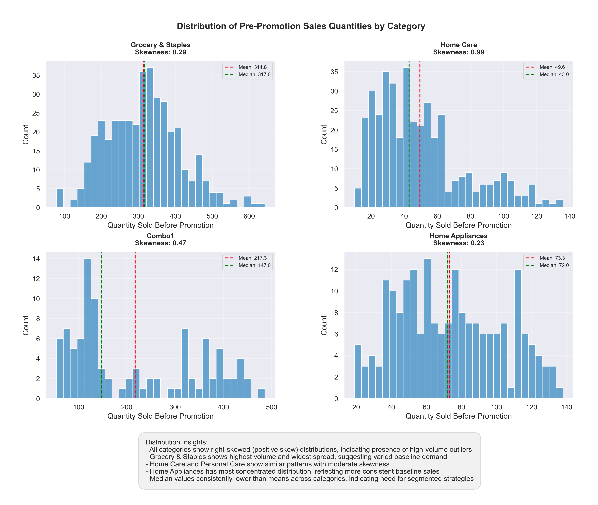
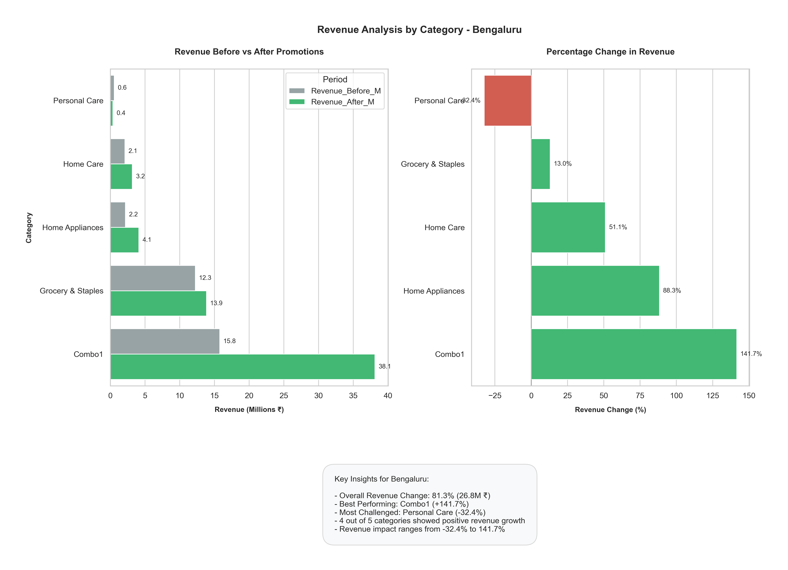
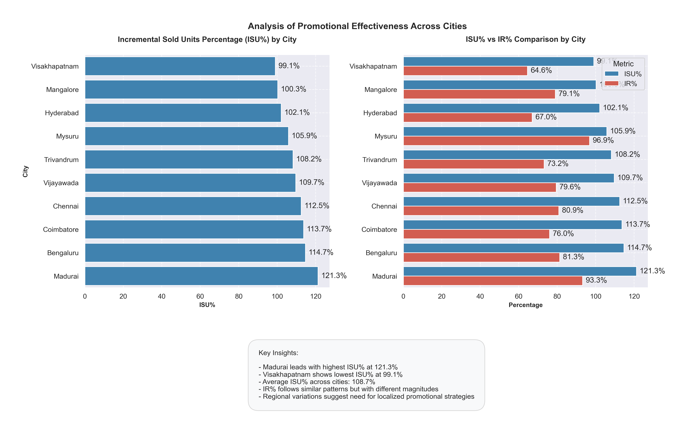
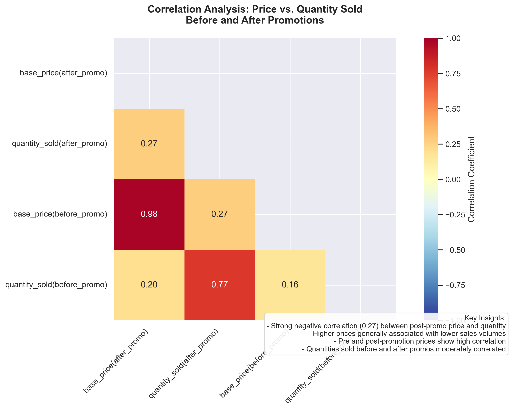

# Nova Mart Campaign Performance Analysis
## Retail Promotion Effectiveness Study

## Table of Contents
1. [Project Background](#project-background)
2. [Data Structure & Initial Checks](#data-structure--initial-checks)
3. [Executive Summary](#executive-summary)
4. [Insights Deep Dive](#insights-deep-dive)
    * [Revenue Performance](#revenue-performance)
    * [Promotional Effectiveness](#promotional-effectiveness)
    * [Store Network Analysis](#store-network-analysis)
    * [Price Sensitivity Analysis](#price-sensitivity-analysis)
5. [Recommendations](#recommendations)
6. [Assumptions and Caveats](#assumptions-and-caveats)

---

## Project Background

Nova Mart operates 50 stores across southern India, specializing in quality products for a diverse customer base with a strong focus on Nova-branded items. This analysis examines the effectiveness of two major promotional campaigns:

* **Diwali Campaign 2023**
* **Sankranti Campaign 2024**

The study provides insights into:

- **Revenue Impact:** How the promotions impacted revenue by category and location.
- **Store Performance:** Variations in performance across stores and geographies.
- **Category Analysis:** Trends and growth in product categories.
- **Price Sensitivity:** Analysis of price-volume relationships to measure promotional impact.

The analysis was conducted using Python, employing libraries such as `pandas` for data manipulation, `matplotlib` and `seaborn` for visualizations, and `numpy` for statistical computations. You can view the complete analysis in this [Jupyter notebook](./Nova%20Mart%20Campaign%20Performance%20Analysis.ipynb).

---

## Data Structure & Initial Checks

To assess campaign effectiveness, data from multiple sources was consolidated, including:

- **Sales Data:** Metrics on sales before and after each promotion.
- **Store Information:** Data on store locations and performance.
- **Product Data:** Details on product category hierarchies and pricing.
- **Campaign Metrics:** Information on promotion types and effectiveness indicators.

The initial distribution analysis of pre-promotion sales reveals trends across categories, as shown in the chart below:

**Key Insights:**
- Sales distributions are right-skewed across categories.
- Grocery & Staples show the highest volume and widest distribution.
- Home Care and Personal Care have similar sales patterns.
- Home Appliances exhibit a more concentrated distribution.

---

## Executive Summary

### Overview of Findings

Our findings reveal substantial variation in campaign performance across locations and product categories. Notably:

- In **Bengaluru**, overall revenue increased by **81.3%** during the campaigns, with Combo1 leading in growth at **141.7%**.
- Four out of five product categories showed revenue growth, with **Personal Care** being the only category to decline (-32.4%).

This chart shows:
- Strong performance in combo deals.
- Robust growth in core categories.
- A performance gap in the Personal Care segment.

---

## Insights Deep Dive

### Revenue Performance

#### Category-wise Analysis - Bengaluru Market

| **Category**         | **Revenue Growth** |
|----------------------|--------------------|
| Combo1               | 141.7%            |
| Home Appliances      | 88.3%             |
| Home Care            | 51.1%             |
| Grocery & Staples    | 13.0%             |
| Personal Care        | -32.4%            |

This visualization highlights revenue trends by category, showing:

- **Combo1** led in growth, likely driven by attractive bundling strategies.
- **Home Appliances** and **Home Care** saw substantial growth, benefiting from seasonal promotions.
- **Personal Care** faced challenges, indicating potential customer demand shifts or promotion mismatches.

---

### Promotional Effectiveness

#### City-wise Performance Analysis

**Key Findings:**
- **Madurai** experienced the highest revenue growth, with a **121.3%** increase in ISU%.
- Strong growth was observed in southern metro areas, validating the campaign’s reach in these regions.
- Regional performance differences suggest the need for tailored promotional strategies.

---

### Store Network Analysis

#### Geographic Distribution

**Distribution Highlights:**
- **Bengaluru** has the largest store count with 10 locations (20% of total).
- **Chennai** and **Hyderabad** follow with 8 (16%) and 7 (14%) stores, respectively.
- A strong presence in tier-2 cities indicates strategic market expansion.

---

### Price Sensitivity Analysis

#### Price-Volume Relationships

**Insights:**
- The **price-volume correlation** is weak (0.27), suggesting that price changes had limited impact on volume.
- **Pre- and post-promotion prices** showed strong consistency (0.98), indicating stable pricing.
- A low **R² value** (0.073) implies that price alone is not the primary revenue driver, suggesting other factors (like bundling) were more impactful.

---

## Recommendations

Based on the analysis, the following strategies are recommended:

1. **Category Strategy**
   - Leverage the strong performance of **Combo1** promotions.
   - Address challenges in the **Personal Care** category through targeted promotions.
   - Expand the scope of successful **Home Appliances** campaigns.

2. **Regional Approach**
   - Tailor promotions to capitalize on the strong performance in top cities.
   - Adjust store network strategies based on location-specific performance metrics.
   - Develop customized strategies for **tier-2 cities**.

3. **Promotional Design**
   - Focus on **non-price-based value propositions** to drive interest without impacting margins.
   - Implement **category-specific promotions** to align with regional and category needs.
   - Balance volume and revenue growth through selective bundling and discounts.

4. **Price Optimization**
   - Maintain consistent base pricing across categories.
   - Develop a **category-focused pricing strategy** to better match customer price sensitivity.
   - Consider regional price adjustments to cater to local purchasing power and demand.

---

## Assumptions and Caveats

### Key Assumptions

1. **Data Consistency**
   - Promotional periods are directly comparable.
   - No significant external disruptions affected the market.
   - Data collection methods remained consistent.

2. **Market Conditions**
   - The competitive environment remained stable.
   - Seasonal sales trends were typical.
   - Operational conditions were standard across locations.

3. **Statistical Assumptions**
   - Sales data follows a normal distribution.
   - Each store’s performance is independent of others.
   - Customer behavior patterns were consistent over time.

